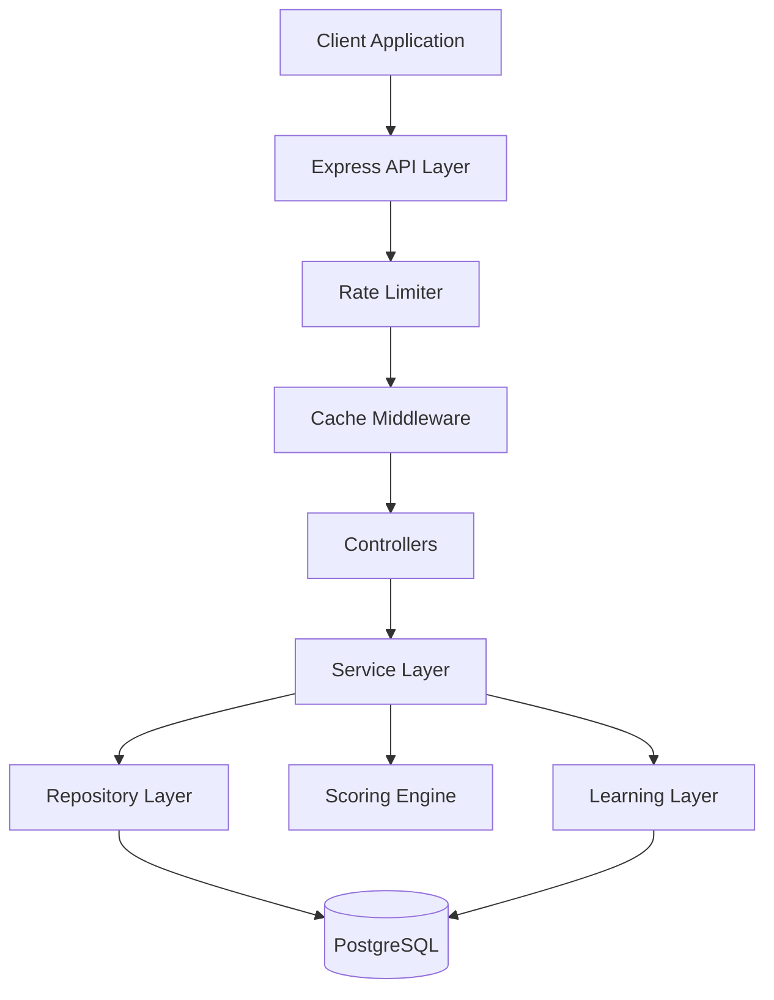

# 🎁 Gimmie Gift Service

> An intelligent gift discovery backend service with personalized recommendations and a learning layer

## 📋 Overview

Gimmie Gift Service is a sophisticated backend API that solves the "Gift Discovery" problem. It allows users to:
- **Search** for products with advanced filters and sorting
- **Get personalized recommendations** based on recipient profiles (age, budget, interests, occasion, relationship)
- **Track user interactions** to continuously improve recommendations through a learning layer

### ✨ Key Features

- 🎯 **Intelligent Scoring Algorithm**: Weighted heuristic system combining interest matching, budget optimization, occasion/relationship keywords
- 📊 **Learning Layer**: User interactions (views, clicks, saves) feed back into the ranking algorithm
- 🤖 **AI-Powered Explanations**: Optional OpenAI integration generates personalized "Why this gift?" explanations
- ⚡ **Performance Optimized**: In-memory caching and strategic database indexes for sub-200ms search responses
- 🛡️ **Enterprise-Ready**: Rate limiting, input validation, error handling, and comprehensive testing
- 🔍 **Advanced Search**: Case-insensitive text search with multiple filters, sorting, and pagination

## 🏗️ Architecture



### Layered Architecture

- **Controller Layer**: HTTP request handling and validation
- **Service Layer**: Business logic (Scoring Algorithm, Learning Logic)
- **Repository Layer**: Database interactions via Prisma
- **Caching Layer**: In-memory cache (node-cache) for frequent queries

## 🚀 Quick Start

### Prerequisites

- Node.js >= 18.0.0
- Docker & Docker Compose
- npm >= 9.0.0

### Installation

1. **Clone the repository**
   ```bash
   cd gimmie-gift-service
   ```

2. **Install dependencies**
   ```bash
   npm install
   ```

3. **Set up environment variables**
   ```bash
   cp .env.example .env
   ```
   
   The default `.env` configuration works out of the box for local development.

4. **Start PostgreSQL with Docker**
   ```bash
   docker-compose up -d
   ```

5. **Initialize the database**
   ```bash
   npx prisma generate
   npx prisma db push
   ```

6. **Seed the database**
   ```bash
   npm run seed
   ```
   
   This will populate the database with 70+ diverse products across multiple categories.

7. **Start the development server**
   ```bash
   npm run dev
   ```

The API will be available at `http://localhost:3000`

## 📚 API Endpoints

### Health Check
```http
GET /api/health
```

### Search Products
```http
GET /api/search?q=gaming&category=Electronics&brand=GamePro&minPrice=50&maxPrice=200&sort=price_asc&limit=20&offset=0
```

**Query Parameters:**
| Parameter | Type | Description |
|-----------|------|-------------|
| `q` | string | Text search in title/description/tags |
| `category` | string | Filter by product category |
| `retailer` | string | Filter by retailer name |
| `brand` | string | Filter by brand name |
| `minPrice` | number | Minimum price filter |
| `maxPrice` | number | Maximum price filter |
| `sort` | string | Sort order: `price_asc`, `price_desc`, `relevance` |
| `limit` | number | Results per page (default: 20, max: 100) |
| `offset` | number | Pagination offset (default: 0) |

**Response:**
```json
{
  "success": true,
  "data": [...],
  "pagination": {
    "total": 45,
    "limit": 20,
    "offset": 0,
    "hasMore": true
  }
}
```

### Get Recommendations
```http
POST /api/recommendations
Content-Type: application/json

{
  "userId": "550e8400-e29b-41d4-a716-446655440000",
  "budget": 100,
  "interests": ["tech", "gaming"],
  "recipientAge": 25,
  "relationship": "friend",
  "occasion": "birthday"
}
```

**Request Body Parameters:**
| Field | Type | Required | Description |
|-------|------|----------|-------------|
| `userId` | string (UUID) | Yes | User identifier |
| `budget` | number | Yes | Maximum budget |
| `interests` | string[] | Yes | Array of interests/hobbies |
| `recipientAge` | number | No | Age of the gift recipient |
| `relationship` | string | No | `friend`, `partner`, `parent`, `sibling`, `colleague`, `child`, `other` |
| `occasion` | string | No | `birthday`, `anniversary`, `wedding`, `graduation`, `christmas`, etc. |

**Response:**
```json
{
  "success": true,
  "data": [
    {
      "id": "...",
      "title": "Gaming Keyboard RGB",
      "price": 89.99,
      "brand": "GamePro",
      "score": 35,
      "scoreBreakdown": {
        "interestMatch": 20,
        "budgetOptimization": 5,
        "occasionMatch": 0,
        "relationshipMatch": 5,
        "learningBoost": 15
      },
      "reason": "Gaming Keyboard RGB is recommended because it matches interests: gaming, tech, great value within budget.",
      "aiExplanation": "This gaming keyboard is perfect for your tech-savvy friend!..."
    }
  ],
  "count": 10
}
```

> [!TIP]
> **AI-Powered Explanations**: Set `OPENAI_API_KEY` in your `.env` file to enable AI-generated gift explanations. See [AI Integration Guide](docs/AI_INTEGRATION.md) for details.

### Get Recommendation Diagnostics
```http
GET /api/recommendations/diagnostics?userId=550e8400-e29b-41d4-a716-446655440000
```

Returns insight into how the learning layer affects a user's recommendations.

**Response:**
```json
{
  "success": true,
  "data": {
    "userId": "550e8400-e29b-41d4-a716-446655440000",
    "topCategories": [
      { "category": "Electronics", "interactionCount": 15 },
      { "category": "Books", "interactionCount": 8 }
    ],
    "topBoostedTags": ["tech", "gaming", "music"],
    "rankingExplanation": "Products in 'Electronics' category receive a +15 point boost...",
    "totalEvents": 23
  }
}
```

### Track User Events
```http
POST /api/events
Content-Type: application/json

{
  "userId": "550e8400-e29b-41d4-a716-446655440000",
  "productId": "abc123-...",
  "eventType": "VIEW_PRODUCT"
}
```

**Event Types:**
- `VIEW_PRODUCT`: User viewed product details
- `CLICK_OUT`: User clicked through to retailer
- `SAVE_PRODUCT`: User saved/favorited the product

## 🧠 The Scoring Algorithm

The recommendation engine uses a sophisticated **Weighted Heuristic Scoring System**:

### Hard Filters (Database Level)
- Budget: `price <= budget * 1.15` (15% buffer for flexibility)

### Soft Scoring (Application Level)

| Factor | Points | Criteria |
|--------|--------|----------|
| **Interest Match** | +10 per tag overlap | Product tags match user interests |
| **Budget Optimization** | +5 | Price is 80-100% of budget (maximizes value) |
| **Occasion Match** | +5 | Title/description contains occasion keywords |
| **Relationship Match** | +5 | Product category matches typical gifts for relationship type |
| **Learning Boost** | +15 | Product category matches user's top interacted category |

**Relevance Explanation**:
For search results sorted by "relevance", products are ordered by creation date (newest first). In a production system, this could be enhanced with:
- Full-text search scoring (PostgreSQL `ts_rank`)
- Popularity metrics (view counts, purchase data)
- User personalization based on event history

## 🔧 Development

### Running Tests

```bash
# Unit tests with coverage
npm test

# Watch mode
npm run test:watch

# Integration tests
npm run test:integration
```

### Database Management

```bash
# Generate Prisma Client
npm run prisma:generate

# Push schema changes
npm run prisma:push

# Open Prisma Studio (DB GUI)
npm run prisma:studio

# Re-seed database
npm run seed
```

## 📊 Data Schema

### Product Model
| Field | Type | Description |
|-------|------|-------------|
| `id` | UUID | Primary Key |
| `title` | String | Searchable product title |
| `description` | String | Searchable product description |
| `price` | Float | Indexed for range filtering |
| `brand` | String | Indexed for filtering |
| `category` | String | Indexed for filtering |
| `retailer` | String | Indexed for filtering |
| `url` | String | Unique constraint for idempotent seeding |
| `imageUrl` | String | Optional product image |
| `tags` | String[] | Array for flexible interest matching |

### Event Model
| Field | Type | Description |
|-------|------|-------------|
| `id` | UUID | Primary Key |
| `userId` | String | UUID, indexed |
| `productId` | String | Foreign Key, indexed |
| `eventType` | Enum | VIEW_PRODUCT, CLICK_OUT, SAVE_PRODUCT |
| `timestamp` | DateTime | Indexed with userId |

## 🚦 Performance Features

### Caching
- **Strategy**: In-memory caching with node-cache
- **TTL**: 5 minutes (configurable)
- **Scope**: Search endpoint only (GET requests)
- **Impact**: Sub-200ms response time on cache hits

### Database Optimization
- **Indexes**: Strategic indexes on `price`, `category`, `retailer`, `brand`, `userId`
- **Pagination**: Default 20 items/page, max 100
- **Query Limits**: Recommendation candidates capped at 100 for fast scoring

### Rate Limiting
- **Limit**: 100 requests per 15 minutes per IP
- **Configurable**: Via environment variables

## 🔒 Security Features

- ✅ Input validation with Zod schemas
- ✅ Rate limiting to prevent abuse
- ✅ SQL injection prevention via Prisma ORM
- ✅ CORS enabled for cross-origin requests
- ✅ Environment variable validation on startup

## 🐳 Docker Support

```bash
# Start database
docker-compose up -d

# Stop database
docker-compose down

# Reset database
docker-compose down -v && docker-compose up -d
```

## 📈 What I'd Improve Next (Given More Time)

### Technical Enhancements
1. **Full-text Search**: Implement PostgreSQL `tsvector` and `ts_rank` for proper relevance scoring
2. **Vector Embeddings**: Use OpenAI embeddings for semantic product matching ("find gifts similar to...")
3. **Redis Caching**: Replace in-memory cache with Redis for distributed deployments
4. **GraphQL API**: Add GraphQL endpoint for flexible client queries

### Product Features
1. **User Authentication**: JWT-based auth with user profiles and preferences
2. **Collaborative Filtering**: "Users who liked this also liked..." recommendations
3. **Product Images**: Image storage and optimization with CDN delivery
4. **Price Tracking**: Historical price data for "best time to buy" insights
5. **Wishlist/Registry**: Save and share gift wishlists

### Operational
1. **Monitoring**: Add Prometheus metrics and Grafana dashboards
2. **CI/CD**: GitHub Actions for automated testing and deployment
3. **API Versioning**: Implement `/v1/` API versioning strategy
4. **Rate Limit Tiers**: Different limits for authenticated vs. anonymous users

## 🛠️ Technology Stack

- **Runtime**: Node.js 18+
- **Language**: TypeScript (strict mode)
- **Framework**: Express.js
- **Database**: PostgreSQL 15
- **ORM**: Prisma
- **Validation**: Zod
- **Caching**: node-cache
- **Testing**: Jest + Supertest
- **Container**: Docker Compose

## 📝 License

MIT

## 🤝 Contributing

Contributions are welcome! Please feel free to submit a Pull Request.

---

**Built with ❤️ for intelligent gift discovery**
