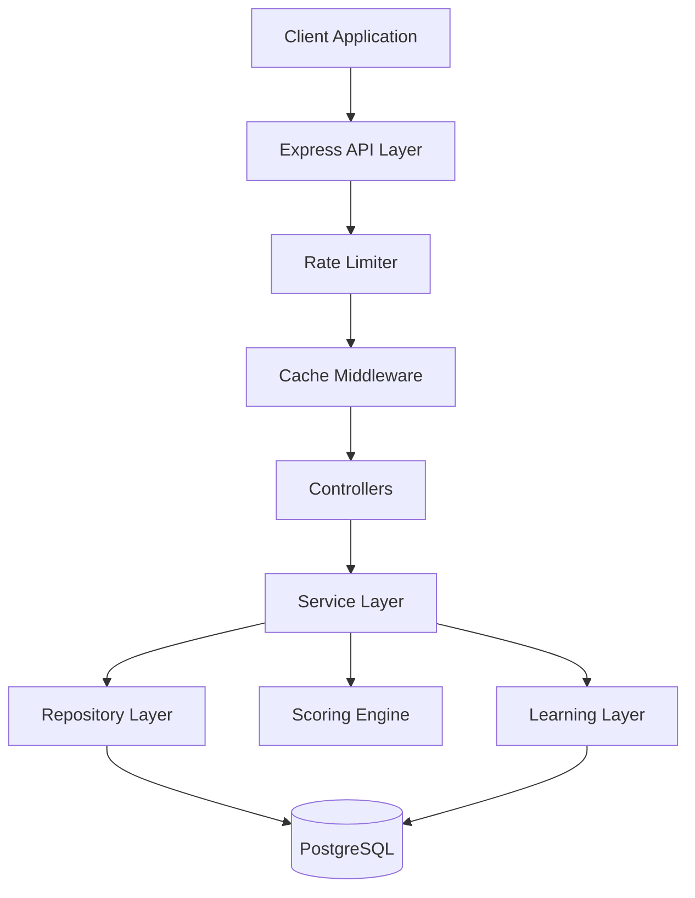

# 🎁 Gimmie Gift Service

> An intelligent gift discovery backend service with personalized recommendations and a learning layer

## 📋 Overview

Gimmie Gift Service is a sophisticated backend API that solves the "Gift Discovery" problem. It allows users to:
- **Search** for products with advanced filters
- **Get personalized recommendations** based on recipient profiles (age, budget, interests, occasion)
- **Track user interactions** to continuously improve recommendations through a learning layer

### ✨ Key Features

- 🎯 **Intelligent Scoring Algorithm**: Weighted heuristic system combining interest matching, budget optimization, and occasion keywords
- 📊 **Learning Layer**: User interactions (views, clicks, saves) feed back into the ranking algorithm
- 🤖 **AI-Powered Explanations**: Optional OpenAI integration generates personalized "Why this gift?" explanations
- ⚡ **Performance Optimized**: In-memory caching and strategic database indexes for sub-200ms search responses
- 🛡️ **Enterprise-Ready**: Rate limiting, input validation, error handling, and comprehensive testing
- 🔍 **Advanced Search**: Case-insensitive text search with multiple filters and pagination

## 🏗️ Architecture



### Layered Architecture

- **Controller Layer**: HTTP request handling and validation
- **Service Layer**: Business logic (Scoring Algorithm, Learning Logic)
- **Repository Layer**: Database interactions via Prisma
- **Caching Layer**: In-memory cache (node-cache) for frequent queries

## 🚀 Quick Start

### Prerequisites

- Node.js >= 18.0.0
- Docker & Docker Compose
- npm >= 9.0.0

### Installation

1. **Clone the repository**
   ```bash
   cd gimmie-gift-service
   ```

2. **Install dependencies**
   ```bash
   npm install
   ```

3. **Set up environment variables**
   ```bash
   cp .env.example .env
   ```
   
   The default `.env` configuration works out of the box for local development.

4. **Start PostgreSQL with Docker**
   ```bash
   docker-compose up -d
   ```

5. **Initialize the database**
   ```bash
   npx prisma generate
   npx prisma db push
   ```

6. **Seed the database**
   ```bash
   npm run seed
   ```
   
   This will populate the database with 70+ diverse products across multiple categories.

7. **Start the development server**
   ```bash
   npm run dev
   ```

The API will be available at `http://localhost:3000`

## 📚 API Endpoints

### Health Check
```http
GET /api/health
```

### Search Products
```http
GET /api/search?category=Electronics&minPrice=50&maxPrice=200&limit=20&offset=0
```

**Query Parameters:**
- `category` (optional): Filter by product category
- `retailer` (optional): Filter by retailer name
- `minPrice` (optional): Minimum price filter
- `maxPrice` (optional): Maximum price filter
- `searchTerm` (optional): Text search in title/description
- `limit` (optional, default: 20, max: 100): Results per page
- `offset` (optional, default: 0): Pagination offset

**Response:**
```json
{
  "success": true,
  "data": [...],
  "pagination": {
    "total": 45,
    "limit": 20,
    "offset": 0,
    "hasMore": true
  }
}
```

### Get Recommendations
```http
POST /api/recommendations
Content-Type: application/json

{
  "userId": "550e8400-e29b-41d4-a716-446655440000",
  "budget": 100,
  "interests": ["tech", "gaming"],
  "age": 25,
  "occasion": "birthday"
}
```

**Response:**
```json
{
  "success": true,
  "data": [
    {
      "id": "...",
      "title": "Gaming Keyboard RGB",
      "price": 89.99,
      "score": 35,
      "scoreBreakdown": {
        "interestMatch": 20,
        "budgetOptimization": 5,
        "occasionMatch": 0,
        "learningBoost": 15
      },
      "aiExplanation": "This gaming keyboard is perfect for your tech-savvy friend! With RGB lighting and mechanical switches, it matches their gaming interests perfectly and fits comfortably within budget."
    }
  ],
  "count": 10
}
```

> [!TIP]
> **AI-Powered Explanations**: Set `OPENAI_API_KEY` in your `.env` file to enable AI-generated gift explanations. See [AI Integration Guide](docs/AI_INTEGRATION.md) for details.

### Track User Events
```http
POST /api/events
Content-Type: application/json

{
  "userId": "550e8400-e29b-41d4-a716-446655440000",
  "productId": "abc123-...",
  "eventType": "VIEW_PRODUCT"
}
```

**Event Types:**
- `VIEW_PRODUCT`: User viewed product details
- `CLICK_OUT`: User clicked through to retailer
- `SAVE_PRODUCT`: User saved/favorited the product

## 🧠 The Scoring Algorithm

The recommendation engine uses a sophisticated **Weighted Heuristic Scoring System**:

### Hard Filters (Database Level)
- Budget: `price <= budget * 1.15` (15% buffer for flexibility)

### Soft Scoring (Application Level)

| Factor | Points | Criteria |
|--------|--------|----------|
| **Interest Match** | +10 per tag overlap | Product tags match user interests |
| **Budget Optimization** | +5 | Price is 80-100% of budget (maximizes value) |
| **Occasion Match** | +5 | Title/description contains occasion keywords |
| **Learning Boost** | +15 | Product category matches user's top interacted category |

**Example:**
```
Product: "Gaming Keyboard RGB" ($90)
User: budget=$100, interests=["gaming", "tech"]

Calculation:
- Interest Match: "gaming" + "tech" = 2 matches × 10 = +20
- Budget Optimization: $90 = 90% of budget = +5
- Occasion Match: No birthday keywords = +0
- Learning Boost: User's top category is "Electronics" = +15

Total Score: 40 points
```

## 🔧 Development

### Running Tests

```bash
# Unit tests
npm test

# Watch mode
npm run test:watch

# Integration tests
npm run test:integration

# Coverage report
npm test -- --coverage
```

### Database Management

```bash
# Generate Prisma Client
npm run prisma:generate

# Push schema changes
npm run prisma:push

# Open Prisma Studio (DB GUI)
npm run prisma:studio

# Re-seed database
npm run seed
```

### Linting & Formatting

```bash
# Lint code
npm run lint

# Format code
npm run format
```

## 📊 Data Schema

### Product Model
- `id`: UUID (Primary Key)
- `title`: String (searchable)
- `description`: String (searchable)
- `price`: Float (indexed for range filtering)
- `category`: String (indexed for filtering)
- `retailer`: String (indexed)
- `url`: String (unique constraint for idempotent seeding)
- `tags`: String[] (array for flexible interest matching)

### Event Model
- `id`: UUID (Primary Key)
- `userId`: String (UUID, indexed)
- `productId`: String (UUID, Foreign Key, indexed)
- `eventType`: Enum (VIEW_PRODUCT, CLICK_OUT, SAVE_PRODUCT)
- `timestamp`: DateTime (indexed with userId)

## 🚦 Performance Features

### Caching
- **Strategy**: In-memory caching with node-cache
- **TTL**: 5 minutes (configurable)
- **Scope**: Search endpoint only (GET requests)
- **Key Generation**: Based on full query string
- **Impact**: Sub-200ms response time on cache hits

### Database Optimization
- **Indexes**: Strategic indexes on `price`, `category`, `retailer`, `userId`
- **Pagination**: Default 20 items/page, max 100
- **Query Limits**: Recommendation candidates capped at 100 for fast scoring

### Rate Limiting
- **Limit**: 100 requests per 15 minutes per IP
- **Response**: 429 Too Many Requests when exceeded
- **Configurable**: Via environment variables

## 🔒 Security Features

- ✅ Input validation with Zod schemas
- ✅ Rate limiting to prevent abuse
- ✅ SQL injection prevention via Prisma ORM
- ✅ CORS enabled for cross-origin requests
- ✅ Environment variable validation on startup

## 🐳 Docker Support

The project includes Docker Compose configuration for PostgreSQL:

```bash
# Start database
docker-compose up -d

# Stop database
docker-compose down

# View logs
docker-compose logs -f

# Reset database
docker-compose down -v
docker-compose up -d
```

## 📈 Future Enhancements

- [ ] Vector search with product embeddings for semantic matching
- [ ] OpenAI integration for "Why this gift?" explanations
- [ ] User authentication and profile management
- [ ] Product image storage and serving
- [ ] Real-time analytics dashboard
- [ ] Collaborative filtering for "Users who liked this also liked..."

## 🛠️ Technology Stack

- **Runtime**: Node.js 18+
- **Language**: TypeScript (strict mode)
- **Framework**: Express.js
- **Database**: PostgreSQL 15
- **ORM**: Prisma
- **Validation**: Zod
- **Caching**: node-cache
- **Testing**: Jest + Supertest
- **Container**: Docker Compose

## 📝 License

MIT

## 🤝 Contributing

Contributions are welcome! Please feel free to submit a Pull Request.

---

**Built with ❤️ for intelligent gift discovery**
