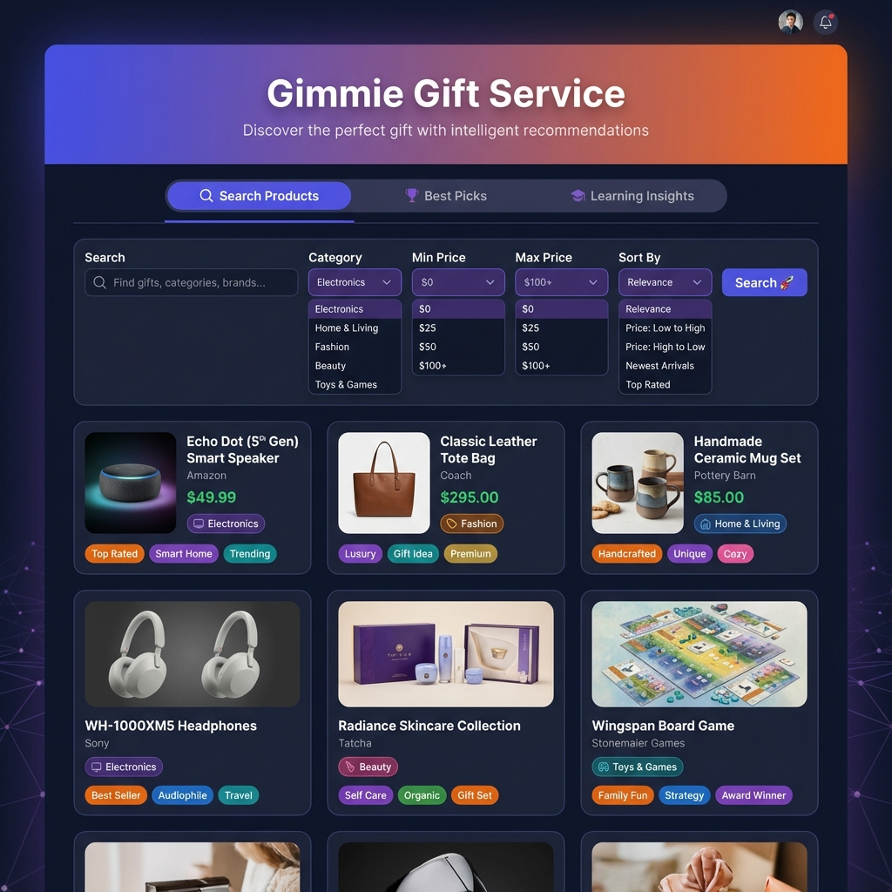
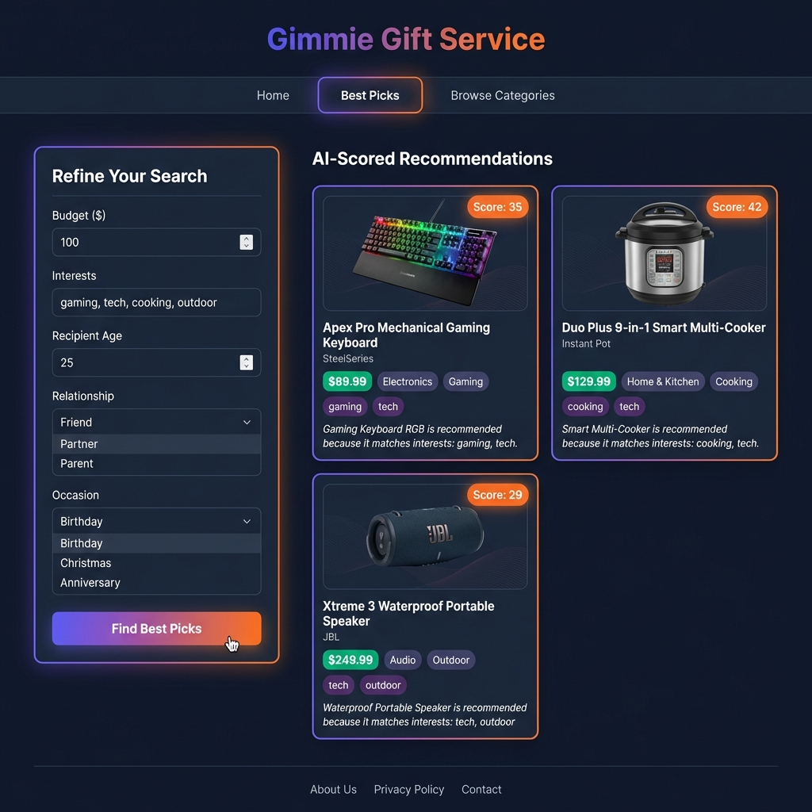
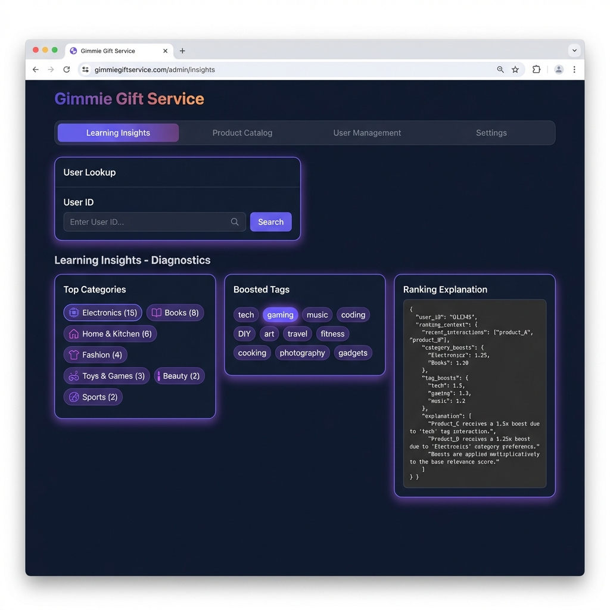
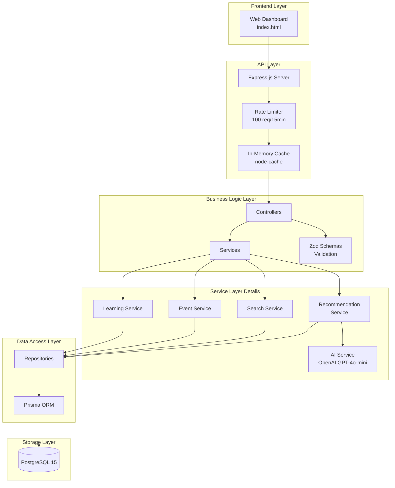
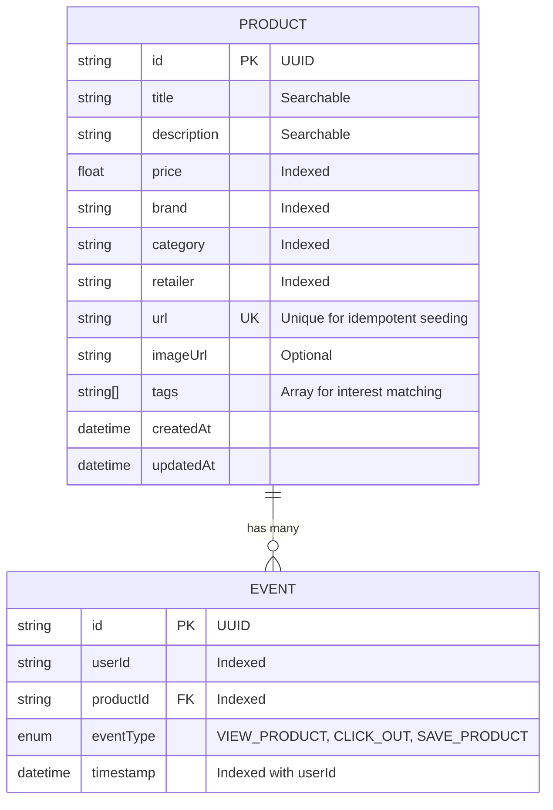
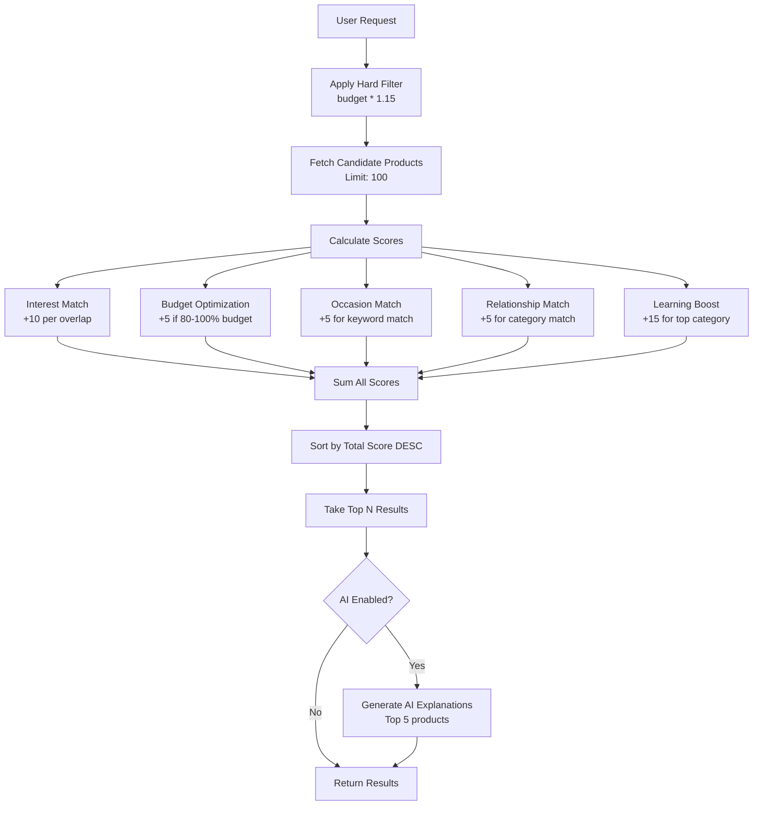

# 🎁 Gimmie Gift Service - Complete Walkthrough

> A comprehensive guide to the intelligent gift discovery backend service with personalized recommendations and learning layer.

## 📸 Application Screenshots

### Search Products Dashboard
The main search interface allows users to discover products with advanced filtering and sorting capabilities.



**Features shown:**
- Text search across product titles, descriptions, and tags
- Category filtering (Electronics, Fashion, Home, etc.)
- Price range filters (Min/Max)
- Sorting options (Relevance, Price ascending/descending)
- Responsive product cards with prices, brands, and tags

---

### AI-Scored Recommendations
The recommendation engine provides personalized gift suggestions based on recipient profiles.



**Features shown:**
- Budget input for price filtering
- Interest-based matching (comma-separated)
- Recipient age consideration
- Relationship type (Friend, Partner, Parent, etc.)
- Occasion context (Birthday, Christmas, Anniversary)
- Score badges showing recommendation strength
- Personalized reason explanations

---

### Learning Insights & Diagnostics
The diagnostics panel reveals how user interactions influence future recommendations.



**Features shown:**
- User ID lookup for diagnostics
- Top interacted categories with counts
- Boosted tags based on browsing history
- Ranking explanation showing how the learning layer affects scores

---

## 🏗️ Architecture Overview

The Gimmie Gift Service follows a **layered architecture** pattern that separates concerns and promotes testability.



### Layer Responsibilities

| Layer | Files/Modules | Responsibility |
|-------|---------------|----------------|
| **API Layer** | `src/index.ts`, middleware/ | HTTP handling, CORS, rate limiting, caching |
| **Controller Layer** | controllers/*.ts | Request parsing, response formatting, error handling |
| **Schema Layer** | schemas/*.ts | Input validation with Zod |
| **Service Layer** | services/*.ts | Business logic, scoring algorithm, AI integration |
| **Repository Layer** | repositories/*.ts | Database queries via Prisma |
| **Data Layer** | prisma/schema.prisma | Data model definitions, migrations |

---

## 📊 Data Model

The application uses two primary entities with a one-to-many relationship.



### Product Model
The `Product` entity represents gift items with rich metadata for filtering and matching:

```typescript
model Product {
  id          String   @id @default(uuid())
  title       String
  description String
  price       Float
  brand       String
  category    String
  retailer    String
  url         String   @unique  // Ensures no duplicate products
  imageUrl    String?
  tags        String[]          // Flexible array for interest matching
  createdAt   DateTime @default(now())
  updatedAt   DateTime @updatedAt
  
  // Indexes for performance
  @@index([price])
  @@index([category])
  @@index([retailer])
  @@index([brand])
}
```

### Event Model
The `Event` entity tracks user interactions for the learning layer:

```typescript
model Event {
  id          String    @id @default(uuid())
  userId      String
  productId   String
  eventType   EventType  // VIEW_PRODUCT | CLICK_OUT | SAVE_PRODUCT
  timestamp   DateTime  @default(now())
  
  product     Product   @relation(fields: [productId], references: [id], onDelete: Cascade)

  // Composite index for efficient user history queries
  @@index([userId])
  @@index([productId])
  @@index([userId, timestamp])
}
```

---

## 🧠 The Scoring Algorithm

The recommendation engine uses a **Weighted Heuristic Scoring System** that combines multiple factors:

### Hard Filters (Database Level)
- **Budget filter**: `price <= budget * 1.15` (15% buffer for flexibility)

### Soft Scoring (Application Level)

| Factor | Points | Description |
|--------|--------|-------------|
| **Interest Match** | +10 per tag | Product tags matching user interests |
| **Budget Optimization** | +5 | Price is 80-100% of budget (maximizes value) |
| **Occasion Match** | +5 | Title/description contains occasion keywords |
| **Relationship Match** | +5 | Product category matches relationship-typical gifts |
| **Learning Boost** | +15 | Product category matches user's top interacted category |

### Scoring Flow



---

## 🔄 Learning Layer

The learning layer analyzes user interaction history to boost relevant products:

1. **Event Collection**: User interactions (views, clicks, saves) are tracked
2. **Category Analysis**: Most interacted categories are identified
3. **Tag Analysis**: Frequently seen product tags are extracted
4. **Boost Application**: Products in top categories receive +15 points

### Diagnostics API
The `/api/recommendations/diagnostics` endpoint exposes how the learning layer affects recommendations:

```json
{
  "success": true,
  "data": {
    "userId": "550e8400-...",
    "topCategories": [
      { "category": "Electronics", "interactionCount": 15 },
      { "category": "Books", "interactionCount": 8 }
    ],
    "topBoostedTags": ["tech", "gaming", "music"],
    "rankingExplanation": "Products in 'Electronics' receive +15 boost...",
    "totalEvents": 23
  }
}
```

---

## 🤖 AI Integration (Optional)

When `OPENAI_API_KEY` is configured, the service generates personalized gift explanations:

- **Model**: GPT-4o-mini (cost-efficient)
- **Scope**: Top 5 recommendations only
- **Token Limit**: 150 tokens per explanation
- **Fallback**: Works without AI (graceful degradation)

---

## ⚖️ Tradeoffs

### 1. In-Memory Cache vs Distributed Cache

**Current Choice**: `node-cache` (in-memory)

| Aspect | In-Memory (Current) | Redis (Alternative) |
|--------|---------------------|---------------------|
| **Latency** | ~1ms | ~2-5ms |
| **Scalability** | Single instance only | Multi-instance support |
| **Persistence** | Lost on restart | Survives restarts |
| **Complexity** | Zero infrastructure | Requires Redis setup |
| **Cost** | Free | Additional service |

**Rationale**: For an MVP/single-instance deployment, in-memory caching provides excellent performance without infrastructure overhead. This decision trades horizontal scalability for simplicity.

---

### 2. Heuristic Scoring vs Machine Learning

**Current Choice**: Weighted heuristic algorithm

| Aspect | Heuristic (Current) | ML-Based (Alternative) |
|--------|---------------------|------------------------|
| **Explainability** | Fully transparent | Black box |
| **Training Data** | Not required | Requires significant data |
| **Cold Start** | Works immediately | Struggles with new users |
| **Accuracy** | Good baseline | Potentially higher |
| **Complexity** | Simple, maintainable | Requires ML infrastructure |

**Rationale**: Heuristic scoring provides interpretable recommendations with immediate functionality. The score breakdown is visible in API responses, enabling debugging and user trust. ML can be added later as data accumulates.

---

### 3. Text Search vs Full-Text Search

**Current Choice**: ILIKE pattern matching with Prisma

| Aspect | ILIKE (Current) | PostgreSQL Full-Text | Elasticsearch |
|--------|-----------------|---------------------|---------------|
| **Setup** | Zero config | Requires tsvector columns | Separate service |
| **Relevance Scoring** | None (binary match) | ts_rank available | Sophisticated |
| **Performance** | O(n) scan | Index-backed | Highly optimized |
| **Typo Tolerance** | None | None | Built-in |

**Rationale**: Simple pattern matching is sufficient for the current product catalog size (~70 items). Full-text search would be essential at scale.

---

### 4. Synchronous AI Calls vs Async/Background Processing

**Current Choice**: Synchronous AI generation during request

| Aspect | Sync (Current) | Async/Background |
|--------|----------------|------------------|
| **Response Time** | +500-1000ms | Immediate |
| **Freshness** | Always current | May be stale |
| **Complexity** | Simple request flow | Requires job queue |
| **User Experience** | Slight delay | Explanations may lag |

**Rationale**: Synchronous generation ensures explanations are always personalized to the current context. The slight latency is acceptable for the enhanced user experience.

---

### 5. UUID Primary Keys vs Auto-Increment

**Current Choice**: UUIDs

| Aspect | UUID (Current) | Auto-Increment |
|--------|----------------|----------------|
| **Distributed Safe** | Yes | Requires coordination |
| **URL Exposure** | Non-guessable | Sequential, predictable |
| **Storage** | 16 bytes | 4-8 bytes |
| **Index Performance** | Slightly slower inserts | Optimal B-tree |

**Rationale**: UUIDs enable future distributed deployments and prevent enumeration attacks. The storage overhead is negligible for this scale.

---

## 🚀 Future Improvements

### Technical Enhancements

#### 1. Full-Text Search with PostgreSQL
```sql
-- Add tsvector column
ALTER TABLE products ADD COLUMN search_vector tsvector;

-- Create GIN index
CREATE INDEX idx_products_search ON products USING gin(search_vector);

-- Use ts_rank for relevance
SELECT *, ts_rank(search_vector, query) as rank
FROM products, plainto_tsquery('gaming keyboard') query
WHERE search_vector @@ query
ORDER BY rank DESC;
```

**Impact**: Proper relevance ranking, partial matching, and significantly better search performance at scale.

---

#### 2. Vector Embeddings for Semantic Search
```typescript
// Future: OpenAI embeddings for "similar products"
const embedding = await openai.embeddings.create({
  model: "text-embedding-3-small",
  input: "wireless gaming headset with rgb"
});

// pgvector for similarity search
SELECT * FROM products
ORDER BY embedding <=> $queryEmbedding
LIMIT 10;
```

**Impact**: Enable "find similar to..." queries and handle fuzzy/semantic user intent.

---

#### 3. Redis Caching for Scalability
```typescript
// Replace node-cache with Redis
import Redis from 'ioredis';

const redis = new Redis(process.env.REDIS_URL);

// Cache with tags for selective invalidation
await redis.set(`search:${queryHash}`, JSON.stringify(results), 'EX', 300);
```

**Impact**: Multi-instance deployment support, cache sharing, and persistence across restarts.

---

#### 4. Collaborative Filtering
```sql
-- Users who viewed X also viewed Y
SELECT p2.id, COUNT(*) as co_view_count
FROM events e1
JOIN events e2 ON e1.user_id = e2.user_id AND e1.product_id != e2.product_id
JOIN products p2 ON e2.product_id = p2.id
WHERE e1.product_id = $productId
GROUP BY p2.id
ORDER BY co_view_count DESC
LIMIT 10;
```

**Impact**: "Users who liked this also liked..." recommendations.

---

### Product Features

| Feature | Description | Value |
|---------|-------------|-------|
| **User Authentication** | JWT-based auth with user profiles | Personalized experiences, saved preferences |
| **Wishlist/Registry** | Save and share gift lists | Social sharing, gift coordination |
| **Price Tracking** | Historical price data | "Best time to buy" insights |
| **Product Images** | CDN-backed image storage | Richer product cards |
| **Gift Wrapping Options** | Virtual gift presentation | Enhanced gifting experience |
| **Budget Groups** | Split gifts among friends | Collaborative purchasing |

---

### Operational Improvements

| Area | Improvement | Tooling |
|------|-------------|---------|
| **Monitoring** | Metrics and dashboards | Prometheus + Grafana |
| **Tracing** | Request tracing | OpenTelemetry |
| **CI/CD** | Automated testing/deployment | GitHub Actions |
| **API Versioning** | `/v1/` prefix strategy | Express Router |
| **Rate Limiting Tiers** | User-based limits | JWT-aware middleware |
| **A/B Testing** | Test ranking variations | Feature flags |

---

## 📈 Performance Optimizations Applied

| Optimization | Implementation | Impact |
|--------------|----------------|--------|
| **Database Indexes** | On price, category, retailer, brand, userId | 10-50x query speedup |
| **Pagination** | Default 20, max 100 per page | Bounded response sizes |
| **Candidate Limit** | Max 100 products scored | Predictable scoring time |
| **Cache TTL** | 5 minutes for search results | Reduced DB load |
| **Rate Limiting** | 100 req/15min per IP | Abuse prevention |
| **Connection Pooling** | Prisma default pool | Efficient DB connections |

---

## 🛠️ Technology Stack Summary

| Category | Technology | Version |
|----------|------------|---------|
| **Runtime** | Node.js | 18+ |
| **Language** | TypeScript | 5.7 |
| **Framework** | Express.js | 4.21 |
| **Database** | PostgreSQL | 15 |
| **ORM** | Prisma | 5.22 |
| **Validation** | Zod | 3.24 |
| **Caching** | node-cache | 5.1 |
| **AI** | OpenAI (gpt-4o-mini) | Latest |
| **Testing** | Jest + Supertest | 29.7 |
| **Container** | Docker Compose | - |

---

## 🎯 Summary

Gimmie Gift Service demonstrates a production-ready approach to building an intelligent recommendation system:

1. **Clean Architecture**: Layered design with clear separation of concerns
2. **Transparent Scoring**: Explainable heuristics with score breakdowns
3. **Adaptive Learning**: User interactions improve future recommendations
4. **AI Enhancement**: Optional GPT-powered personalization
5. **Performance Focus**: Strategic caching and database optimization
6. **Pragmatic Tradeoffs**: MVP-appropriate decisions with clear upgrade paths

The service is designed to evolve from a focused MVP to a full-featured gift discovery platform as requirements grow.

---

**Built with ❤️ for intelligent gift discovery**
